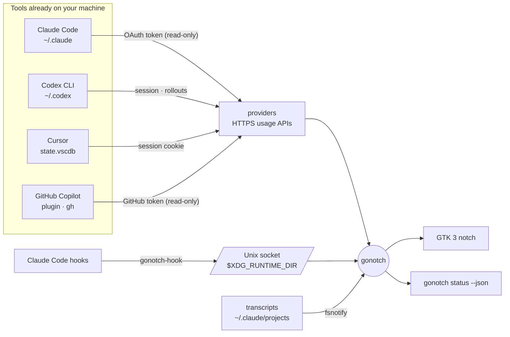

<div align="center">


[](https://github.com/leock9/gonotch/actions/workflows/ci.yml)


[](LICENSE)

**How much of your AI coding allowance is left — and is Claude still working?**<br>
A small black notch on the edge of your Linux desktop answers both at a glance.

[🇧🇷 Leia em português](README.pt-BR.md)


</div>

---

## What it shows

One ring per coding assistant, coloured by how much of its limit is gone — green under half,
yellow under 80 %, red after — with a thinner outer ring for the weekly limit. Claude's ring also
tells you what your sessions are doing:

<div align="center">

|  |
|:--:|
| **working** — a white arc turns · **waiting on you** — a yellow pulse · **auto-hidden** — a thin strip that still pulses |

</div>

Hover a ring for its limit windows, reset times and — for Claude — every running session. Click a
session to jump to its terminal; click a ring to read it again; right-click for the menu.

<div align="center">

|  |  |
|:--:|:--:|
| The hover card | Settings: rings, order, edge, height, auto-hide |

</div>

| Ring | Where the number comes from |
|---|---|
| **Claude Code** | Claude Code's own OAuth credential (`~/.claude/.credentials.json`) against the endpoint its `/usage` asks. Current session plus weekly ring. The token is renewed by running `claude -p` shortly before it expires. |
| **Codex** | The Codex CLI's session (`~/.codex/auth.json`) against ChatGPT's usage endpoint; without a sign-in, the limits the last run wrote into `~/.codex/sessions`. |
| **Cursor** | The editor's own session in its `state.vscdb`, against `cursor.com/api/usage-summary`. |
| **GitHub Copilot** | The sign-in of Copilot's own editor plugins (`~/.config/github-copilot/apps.json`), or else the GitHub CLI's (`gh auth login`), against the quota endpoint Copilot's editors ask. Premium requests on paid plans; chat and code completions on Free, all monthly. |

Credentials are borrowed **read-only** from the tools that own them: gonotch never signs in, never
refreshes or writes a token, and never logs one. A tool that isn't installed simply gets no ring.

## Install

A prebuilt binary into `~/.local/bin` — no root, no Go toolchain. Ubuntu 22.04 → 26.04, or any
x86_64 Linux with GTK 3:

```bash
curl -fsSL https://raw.githubusercontent.com/leock9/gonotch/main/scripts/install.sh | sh -s -- --hooks --autostart
```

`--hooks` wires Claude Code's hooks to gonotch for exact working / waiting states, and `--autostart`
starts it at login; leave them out to decide later. Then:

```bash
gonotch demo    # try it first, with made-up numbers and sessions
gonotch         # the real thing, on the right edge of the primary monitor
```

<details>
<summary>Other ways to install, update, uninstall</summary>

#### .deb

From the [latest release](https://github.com/leock9/gonotch/releases/latest):

```bash
sudo apt install ./gonotch_*_amd64.deb
```

#### From source

Go 1.26 or newer (https://go.dev/dl), then:

```bash
sudo apt install build-essential pkg-config libgtk-3-dev libgirepository1.0-dev
git clone https://github.com/leock9/gonotch && cd gonotch
make install    # → ~/.local/bin; the first build compiles the GTK bindings for several minutes
```

#### Update and uninstall

```bash
gonotch update          # install the latest release and restart the notch on it
gonotch update --check  # only say whether there is one
```

Once a day gonotch asks GitHub which release is the latest; a newer one is announced with a desktop
notification and waits at the top of the notch's right-click menu (*Update to vX.Y.Z*, *What's new*).
Nothing but that request is sent; switch it off under Settings › Updates. What changed in each
release is in the [changelog](CHANGELOG.md). Installed from the `.deb`, update with `apt` as you
installed it; before v0.3.0, run the installer again.

To remove gonotch, its Claude Code hooks and its autostart entry:

```bash
curl -fsSL https://raw.githubusercontent.com/leock9/gonotch/main/scripts/install.sh | sh -s -- --uninstall
```

</details>

<details>
<summary>All commands</summary>

| Command | |
|---|---|
| `gonotch` | Run the notch (running it again opens the settings of the one already running) |
| `gonotch demo` | Run it with demo data — no accounts, no network |
| `gonotch settings` | Open the settings window |
| `gonotch status [--json]` | The readings in a terminal, or as JSON for a status bar (Waybar, Polybar, tmux) |
| `gonotch doctor` | What each provider finds on this machine |
| `gonotch log` | The end of the log, where errors are kept |
| `gonotch install-hooks` / `uninstall-hooks` | Wire Claude Code's hooks to `gonotch-hook`, or remove them |
| `gonotch autostart on\|off` | An XDG autostart entry |
| `gonotch update [--check]` | Install the latest release and restart the notch on it |
| `gonotch version` | The installed version, and a newer one once it has been found |

`install-hooks` edits `~/.claude/settings.json` in place — only its own entries, keeping the rest of
the file's order and format — and writes a backup first. Without hooks, session states are inferred
from Claude Code's transcripts.

</details>

<details>
<summary>Logs</summary>

Errors go to `~/.local/state/gonotch/gonotch.log` (`$XDG_STATE_HOME/gonotch/`): a provider that
could not read and when it read again, a hook that could not reach the app, a failed Claude token
renewal, GTK's own warnings, and the stack trace of a crash. Each failure is one line, however many
polls repeat it. The file is kept across runs and moves to `gonotch.log.1` past 1 MiB, so it never
takes more than about 2 MiB. Nothing in it carries a credential.

```bash
gonotch log                                   # the last 50 lines — attach them to an issue
tail -f ~/.local/state/gonotch/gonotch.log    # follow it
```

The notch's right-click menu has **Open log** too.

</details>

<details>
<summary>Auto-hide</summary>


Turn it on in the settings and the notch tucks into a thin strip on the edge. The strip's line
carries the colour of the fullest ring, and pulses yellow when a Claude session is waiting on you.
Touch the edge with the pointer and the notch slides out; move away and it slides back.

<br clear="right">
</details>

## How it works



- **One Go binary**, a GTK 3 window drawn with Cairo. The notch is an override-redirect X11 window
  with an input shape, so every click outside the pill goes to the window behind it — no pointer
  polling. On Wayland it runs through XWayland.
- **`gonotch-hook`** is a tiny static binary Claude Code runs on each hook (≈ 3 ms). It posts the
  event to the app over a Unix socket in a directory only your user can enter, and starts the app if needed.
- **Providers** poll every 5 minutes — every minute for Claude while a session works — back off on
  HTTP 429 as the vendors ask, and keep the last reading, dimmed, when a read fails. A number is never invented.

## Compatibility

Tested in containers on every supported Ubuntu, building from source and driving the real window:

| | 22.04 LTS | 24.04 LTS | 25.10 | 26.04 LTS |
|---|:--:|:--:|:--:|:--:|
| GLib / GTK | 2.72 / 3.24.33 | 2.80 / 3.24.41 | 2.86 / 3.24.50 | 2.88 / 3.24.52 |
| Build & tests | ✅ | ✅ | ✅ | ✅ |
| X11 | ✅ | ✅ | ✅ | ✅ |
| GNOME on Wayland (via XWayland) | — | ✅ mutter 46 | not tested | ✅ mutter 50 |
| Binary built on 22.04 runs as is | — | ✅ | ✅ | ✅ |

Known limits: on Wayland, clicking a session can't bring a native Wayland terminal forward (those
windows aren't visible to X11); fractional scaling under XWayland hasn't been tested.

## Footprint

Measured on the real window, Ubuntu 26.04, GNOME:

| | CPU | Wakeups/s | Memory |
|---|--:|--:|--:|
| Idle | ~0 % | ~9 | RSS ≈ 65–100 MB, of which ≈ 13 MB private — the rest is GTK, shared with every other GTK app |
| A Claude session working (arc turning) | ~0.8 % | ~240 | |
| `gonotch-hook`, per Claude Code tool call | ≈ 3 ms | — | ≈ 6 MB peak |

## Development

```bash
make build          # bin/gonotch, bin/gonotch-hook
make test           # the core: no cgo, so it never waits for GTK to compile
make screenshots    # re-render docs/assets from the real drawing code, in a container
```

- `internal/` outside `internal/ui` is cgo-free by design; `internal/ui` is GTK and Cairo.
- The GTK bindings are [gotk4](https://github.com/diamondburned/gotk4) **v0.2.2**, the last release
  generated against a GLib as old as Ubuntu 22.04's. It builds against 2.88 as well.
- gotk4 v0.2.2 drops each frame's `cairo_t` in a GC finalizer, off the GTK thread, which can hang the
  main loop in `XSync`; the draw handler releases it on the GTK thread instead (`release` in `internal/ui/ui.go`).
- A Homebrew `ld` ahead of `/usr/bin` on `PATH` breaks the link; the Makefile passes `-B/usr/bin/`.

Contributions are welcome — see [CONTRIBUTING.md](CONTRIBUTING.md).

## Credits

gonotch is a Linux-first reimagining, in Go, of **[Codenotch](https://github.com/vinzdg/codenotch)**
by [@vinzdg](https://github.com/vinzdg) — the original notch for macOS, written in Swift, and its
**[Windows port written in Rust on Tauri 2](https://github.com/vinzdg/codenotch/tree/main/windows)**.
The notch's design, measures and palette, and the documented behaviour of every provider, come from
there; the Rust port's providers were the reference this implementation follows. gonotch is a new
implementation, not a fork. Codenotch is MIT-licensed.

- Provider marks from [Lobe Icons](https://github.com/lobehub/lobe-icons) (MIT). They are trademarks
  of Anthropic, OpenAI and Anysphere, used only to identify the product whose usage is shown; gonotch
  is not affiliated with any of them.
- The Go gopher was designed by [Renée French](https://reneefrench.blogspot.com/) and is licensed
  under [CC BY 4.0](https://creativecommons.org/licenses/by/4.0/). The banner uses the headlamp gopher
  from [go.dev](https://go.dev/blog/gopher).
- GTK bindings by [gotk4](https://github.com/diamondburned/gotk4); SQLite by [modernc.org/sqlite](https://gitlab.com/cznic/sqlite).

## License

[MIT](LICENSE)
