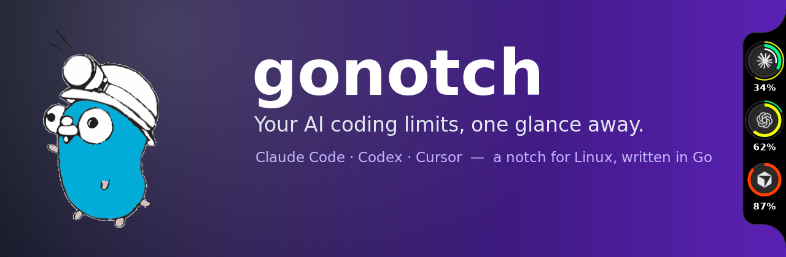
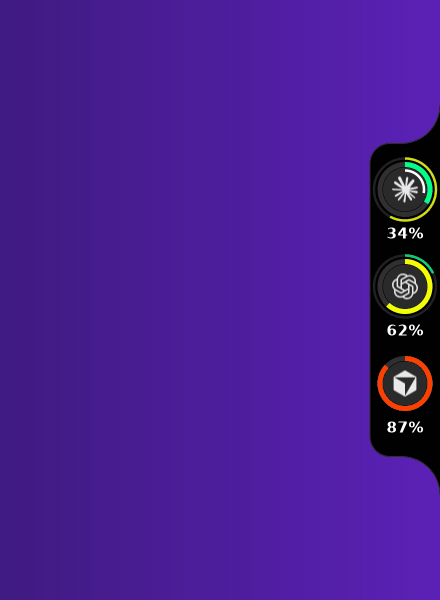
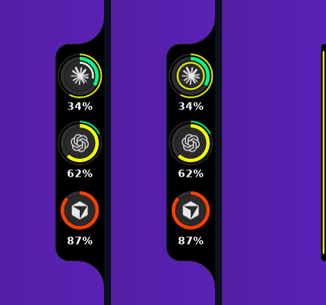
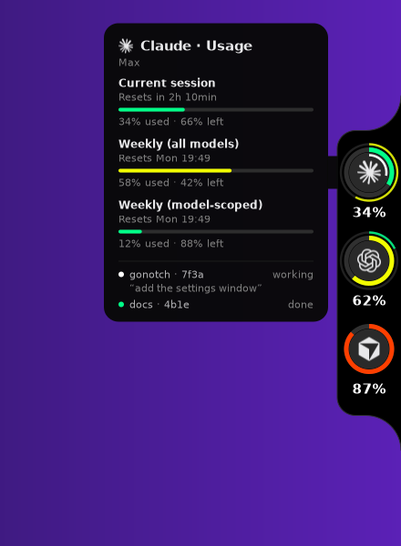
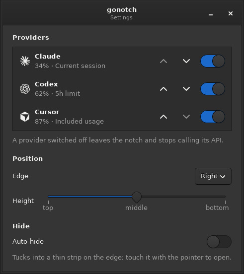
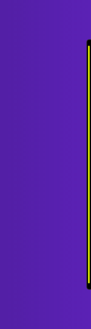
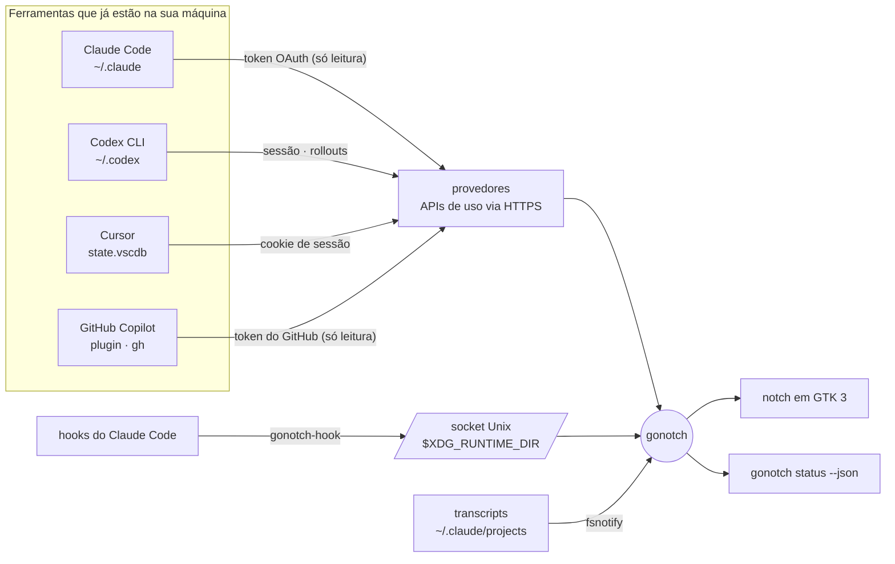

<div align="center">



[](https://github.com/leock9/gonotch/actions/workflows/ci.yml)


[](LICENSE)

**Quanto ainda resta da sua cota de IA para programar — e o Claude ainda está trabalhando?**<br>
Um pequeno notch preto na borda do seu desktop Linux responde as duas coisas num relance.

[🇺🇸 Read in English](README.md)



</div>

---

## O que ele mostra

Um anel por assistente de código, colorido pelo quanto do limite já foi usado — verde abaixo da
metade, amarelo abaixo de 80 %, vermelho depois disso — e um anel externo mais fino para o limite
semanal. O anel do Claude também mostra o que as suas sessões estão fazendo:

<div align="center">

|  |
|:--:|
| **trabalhando** — um arco branco gira · **esperando você** — um pulso amarelo · **auto-ocultar** — uma faixa fina que continua pulsando |

</div>

Passe o mouse num anel para ver as janelas de limite, quando reiniciam e — no Claude — cada sessão
em andamento. Clique numa sessão para ir ao terminal dela; clique num anel para ler de novo; botão
direito abre o menu.

<div align="center">

|  |  |
|:--:|:--:|
| O cartão de hover | Configurações: anéis, ordem, borda, altura, auto-ocultar |

</div>

A interface segue o idioma do sistema: português ou inglês.

| Anel | De onde vem o número |
|---|---|
| **Claude Code** | A credencial OAuth do próprio Claude Code (`~/.claude/.credentials.json`), no mesmo endpoint que o `/usage` dele consulta. Sessão atual mais o anel semanal. O token é renovado rodando `claude -p` pouco antes de expirar. |
| **Codex** | A sessão da CLI do Codex (`~/.codex/auth.json`) no endpoint de uso do ChatGPT; sem login, os limites que a última execução gravou em `~/.codex/sessions`. |
| **Cursor** | A sessão do próprio editor no `state.vscdb`, em `cursor.com/api/usage-summary`. |
| **GitHub Copilot** | O login dos plugins do próprio Copilot (`~/.config/github-copilot/apps.json`) ou, na falta dele, o do GitHub CLI (`gh auth login`), no endpoint de cota que os editores do Copilot consultam. Requisições premium nos planos pagos; chat e completions de código no Free, tudo mensal. |

As credenciais são emprestadas **só para leitura** das ferramentas que são donas delas: o gonotch
nunca faz login, nunca renova nem grava um token e nunca registra um em log. Uma ferramenta que não
está instalada simplesmente não ganha anel.

## Instalação

Um binário pronto em `~/.local/bin` — sem root e sem Go. Ubuntu 22.04 → 26.04, ou qualquer Linux
x86_64 com GTK 3:

```bash
curl -fsSL https://raw.githubusercontent.com/leock9/gonotch/main/scripts/install.sh | sh -s -- --hooks --autostart
```

`--hooks` liga os hooks do Claude Code ao gonotch para estados exatos (trabalhando / esperando
você), e `--autostart` inicia com a sessão; deixe de fora para decidir depois. Então:

```bash
gonotch demo    # experimente antes, com números e sessões fictícios
gonotch         # pra valer, na borda direita do monitor principal
```

<details>
<summary>Outras formas de instalar, atualizar e remover</summary>

#### .deb

Da [última release](https://github.com/leock9/gonotch/releases/latest):

```bash
sudo apt install ./gonotch_*_amd64.deb
```

#### Do código-fonte

Go 1.26 ou mais novo (https://go.dev/dl), e então:

```bash
sudo apt install build-essential pkg-config libgtk-3-dev libgirepository1.0-dev
git clone https://github.com/leock9/gonotch && cd gonotch
make install    # → ~/.local/bin; a primeira compilação leva alguns minutos nos bindings de GTK
```

#### Atualizar e remover

```bash
gonotch update          # instala a última versão e reinicia o notch nela
gonotch update --check  # só diz se há uma nova
```

Uma vez por dia o gonotch pergunta ao GitHub qual é a última versão; uma mais nova é avisada com uma
notificação do desktop e fica no topo do menu do botão direito do notch (*Atualizar para vX.Y.Z*,
*Novidades*). Nada além dessa consulta é enviado; desligue em Configurações › Atualizações. O que
mudou em cada versão está no [changelog](CHANGELOG.md). Instalado pelo `.deb`, atualize com o `apt`,
como instalou; antes da v0.3.0, rode o instalador de novo.

Para remover o gonotch, os hooks do Claude Code e a entrada de autostart:

```bash
curl -fsSL https://raw.githubusercontent.com/leock9/gonotch/main/scripts/install.sh | sh -s -- --uninstall
```

</details>

<details>
<summary>Todos os comandos</summary>

| Comando | |
|---|---|
| `gonotch` | Roda o notch (rodar de novo abre as configurações do que já está rodando) |
| `gonotch demo` | Roda com dados de demonstração — sem contas, sem rede |
| `gonotch settings` | Abre a janela de configurações |
| `gonotch status [--json]` | As leituras no terminal, ou em JSON para uma barra de status (Waybar, Polybar, tmux) |
| `gonotch doctor` | O que cada provedor encontra nesta máquina |
| `gonotch log` | O fim do log, onde ficam os erros |
| `gonotch install-hooks` / `uninstall-hooks` | Liga os hooks do Claude Code ao `gonotch-hook`, ou remove |
| `gonotch autostart on\|off` | Uma entrada de autostart XDG |
| `gonotch update [--check]` | Instala a última versão e reinicia o notch nela |
| `gonotch version` | A versão instalada, e uma mais nova quando já foi encontrada |

O `install-hooks` edita o `~/.claude/settings.json` no lugar — só as próprias entradas, mantendo a
ordem e o formato do resto do arquivo — e faz um backup antes. Sem hooks, os estados das sessões
são deduzidos dos transcripts do Claude Code.

</details>

<details>
<summary>Logs</summary>

Os erros vão para `~/.local/state/gonotch/gonotch.log` (`$XDG_STATE_HOME/gonotch/`): um provedor que
não conseguiu ler e quando voltou a ler, um hook que não alcançou o app, uma renovação do token do
Claude que falhou, os avisos do próprio GTK e o stack trace de um crash. Cada falha vira uma linha,
não importa quantas consultas a repitam. O arquivo é mantido entre execuções e passa para
`gonotch.log.1` depois de 1 MiB, então nunca ocupa mais que uns 2 MiB. Nada nele carrega credencial.

```bash
gonotch log                                   # as últimas 50 linhas — anexe numa issue
tail -f ~/.local/state/gonotch/gonotch.log    # acompanhar ao vivo
```

O menu do botão direito do notch também tem **Abrir log**.

</details>

<details>
<summary>Auto-ocultar</summary>



Ligue nas configurações e o notch se recolhe numa faixa fina na borda. A linha da faixa tem a cor do
anel mais cheio e pisca em amarelo quando uma sessão do Claude está esperando você. Encoste o mouse
na borda e o notch desliza para fora; afaste e ele volta.

<br clear="right">
</details>

## Como funciona



- **Um binário Go**, uma janela GTK 3 desenhada com Cairo. O notch é uma janela X11 override-redirect
  com input shape, então qualquer clique fora da pílula vai para a janela de trás — sem ficar
  consultando o mouse. No Wayland ele roda via XWayland.
- **`gonotch-hook`** é um binário estático minúsculo que o Claude Code roda a cada hook (≈ 3 ms). Ele
  manda o evento para o app por um socket Unix num diretório que só o seu usuário acessa, e sobe o
  app se preciso.
- **Provedores** consultam a cada 5 minutos — a cada minuto no Claude enquanto uma sessão trabalha —,
  recuam em HTTP 429 como os fornecedores pedem e mantêm a última leitura, esmaecida, quando uma
  consulta falha. Nenhum número é inventado.

## Compatibilidade

Testado em containers em todas as versões suportadas do Ubuntu, compilando do código-fonte e rodando
a janela de verdade:

| | 22.04 LTS | 24.04 LTS | 25.10 | 26.04 LTS |
|---|:--:|:--:|:--:|:--:|
| GLib / GTK | 2.72 / 3.24.33 | 2.80 / 3.24.41 | 2.86 / 3.24.50 | 2.88 / 3.24.52 |
| Compilação e testes | ✅ | ✅ | ✅ | ✅ |
| X11 | ✅ | ✅ | ✅ | ✅ |
| GNOME em Wayland (via XWayland) | — | ✅ mutter 46 | não testado | ✅ mutter 50 |
| Binário compilado na 22.04 roda sem recompilar | — | ✅ | ✅ | ✅ |

Limites conhecidos: no Wayland, clicar numa sessão não traz para frente um terminal Wayland nativo
(essas janelas não aparecem para o X11); escala fracionada via XWayland não foi testada.

## Consumo

Medido na janela real, Ubuntu 26.04, GNOME:

| | CPU | Wakeups/s | Memória |
|---|--:|--:|--:|
| Em repouso | ~0 % | ~9 | RSS ≈ 65–100 MB, dos quais ≈ 13 MB próprios — o resto é GTK, compartilhado com os outros apps GTK |
| Sessão do Claude trabalhando (arco girando) | ~0,8 % | ~240 | |
| `gonotch-hook`, por ferramenta usada no Claude Code | ≈ 3 ms | — | ≈ 6 MB de pico |

## Desenvolvimento

```bash
make build          # bin/gonotch, bin/gonotch-hook
make test           # o núcleo: sem cgo, nunca espera o GTK compilar
make screenshots    # regera docs/assets a partir do código de desenho real, num container
```

- `internal/` fora de `internal/ui` é livre de cgo por design; `internal/ui` é GTK e Cairo.
- Os bindings de GTK são o [gotk4](https://github.com/diamondburned/gotk4) **v0.2.2**, a última versão
  gerada contra uma GLib tão antiga quanto a do Ubuntu 22.04. Compila também contra a 2.88.
- O gotk4 v0.2.2 solta o `cairo_t` de cada quadro num finalizador do GC, fora da thread do GTK, o que
  pode travar o loop principal em `XSync`; o handler de desenho solta na thread do GTK (`release` em `internal/ui/ui.go`).
- Um `ld` do Homebrew antes de `/usr/bin` no `PATH` quebra o link; o Makefile passa `-B/usr/bin/`.

Contribuições são bem-vindas — veja o [CONTRIBUTING.md](CONTRIBUTING.md).

## Créditos

O gonotch é uma releitura em Go, pensada primeiro para Linux, do **[Codenotch](https://github.com/vinzdg/codenotch)**
de [@vinzdg](https://github.com/vinzdg) — o notch original para macOS, escrito em Swift, e seu
**[port para Windows escrito em Rust com Tauri 2](https://github.com/vinzdg/codenotch/tree/main/windows)**.
O design, as medidas e a paleta do notch, e o comportamento documentado de cada provedor, vêm de lá;
os provedores do port em Rust foram a referência que esta implementação segue. O gonotch é uma
implementação nova, não um fork. O Codenotch é licenciado sob MIT.

- Marcas dos provedores do [Lobe Icons](https://github.com/lobehub/lobe-icons) (MIT). São marcas
  registradas da Anthropic, OpenAI e Anysphere, usadas só para identificar o produto cujo uso é
  mostrado; o gonotch não tem afiliação com nenhuma delas.
- O gopher do Go foi criado por [Renée French](https://reneefrench.blogspot.com/) e é licenciado sob
  [CC BY 4.0](https://creativecommons.org/licenses/by/4.0/). O banner usa o gopher de lanterna do
  [go.dev](https://go.dev/blog/gopher).
- Bindings de GTK do [gotk4](https://github.com/diamondburned/gotk4); SQLite do [modernc.org/sqlite](https://gitlab.com/cznic/sqlite).

## Licença

[MIT](LICENSE)
